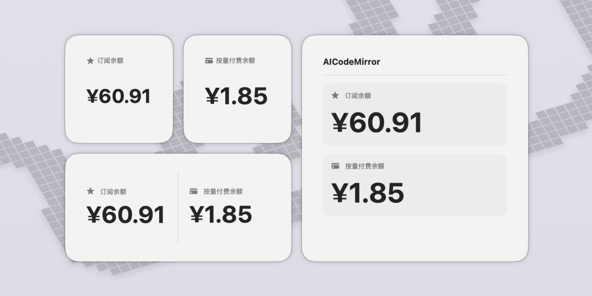

<p align="center">
  
</p>


<h1 align="center">AiCodeMirror Monitor</h1>

<p align="center">
  macOS 菜单栏/小组件应用，实时监控 <a href="https://aicodemirror.com">AiCodeMirror</a> 账户余额
</p>


<p align="center">
  
  
  
</p>

## 功能特性

- **菜单栏快捷访问** - 一键查看账户余额，不打断工作流
- **仪表盘视图** - 显示订阅状态、按量付费余额等详细信息
- **桌面小组件** - 支持小、中、大三种尺寸
- **自动刷新** - 定时更新余额数据
- **原生体验** - 纯 SwiftUI 构建，轻量高效

## 系统要求

- macOS 14.0 (Sonoma) 或更高版本

## 安装

### 方式一：下载 DMG（推荐）

从 [Releases](https://github.com/zzzhizhia/AiCodeMirror-Monitor/releases) 下载最新版本，打开 DMG 后将应用拖入 Applications 文件夹。

### 方式二：从源码编译

```bash
# 克隆仓库
git clone https://github.com/zzzhizhia/AiCodeMirror-Monitor.git
cd AiCodeMirror-Monitor

# 使用 Xcode 打开
open "AiCodeMirror Monitor.xcodeproj"
```

在 Xcode 中为 `AiCodeMirror Monitor` 和 `BalanceWidgetExtension` 配置开发者团队后编译运行。

## 使用方法

1. 启动应用，点击菜单栏图标
2. 登录 AiCodeMirror 账户
3. 即可在菜单栏和桌面小组件中查看余额

## 许可证

MIT License
